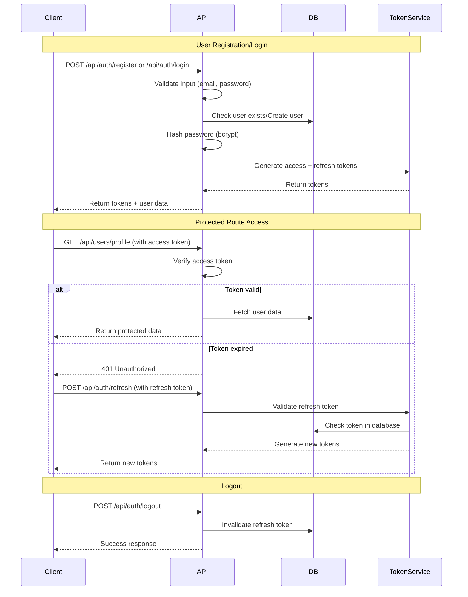
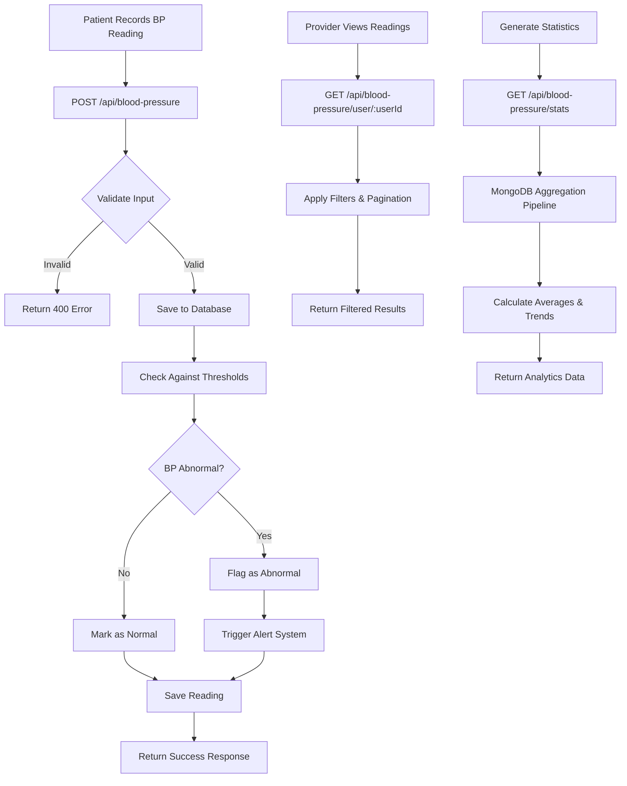
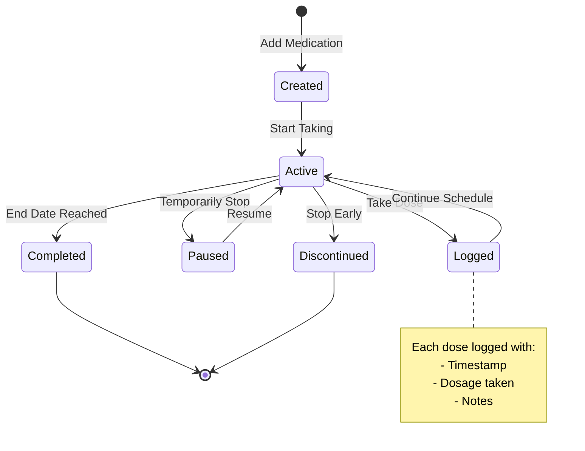
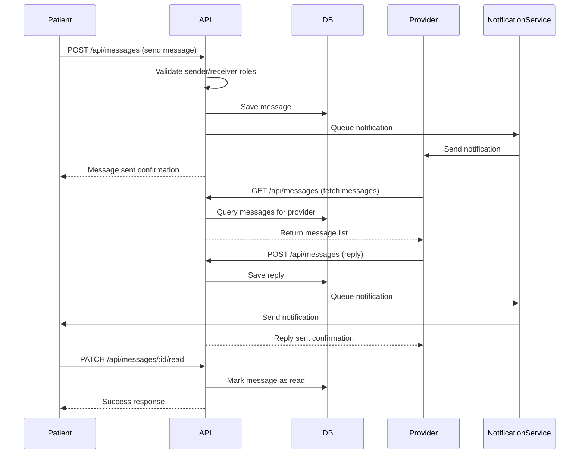
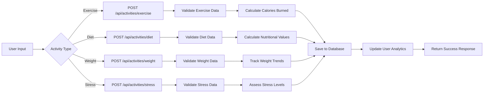
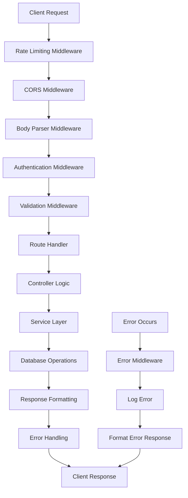
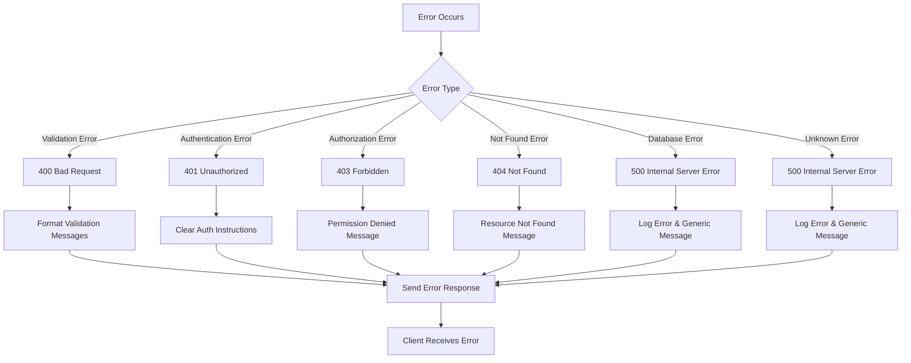
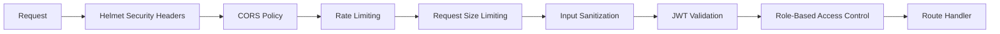

# Blood Pressure Management API - Flow Documentation

## Table of Contents
1. [Authentication Flow](#authentication-flow)
2. [Blood Pressure Management Flow](#blood-pressure-management-flow)
3. [Medication Management Flow](#medication-management-flow)
4. [Provider-Patient Communication Flow](#provider-patient-communication-flow)
5. [Lifestyle Tracking Flow](#lifestyle-tracking-flow)
6. [Data Flow Architecture](#data-flow-architecture)
7. [Error Handling Flow](#error-handling-flow)

## Authentication Flow

### JWT Token-Based Authentication with Refresh Token Rotation



### Authentication Endpoints Flow

**Registration Flow:**
```
POST /api/auth/register
├── Input Validation (email, password, role)
├── Check if user exists
├── Hash password with bcrypt
├── Create user in database
├── Generate JWT tokens
└── Return user data + tokens
```

**Login Flow:**
```
POST /api/auth/login
├── Input Validation (email, password)
├── Find user by email
├── Compare password with bcrypt
├── Generate JWT tokens
├── Save refresh token to database
└── Return user data + tokens
```

## Blood Pressure Management Flow

### Blood Pressure Reading Lifecycle



### Blood Pressure API Endpoints

**Create Reading:**
```javascript
POST /api/blood-pressure
Headers: { Authorization: "Bearer <access_token>" }
Body: {
  "systolic": 120,
  "diastolic": 80,
  "pulse": 72,
  "notes": "Morning reading after exercise"
}

Response: {
  "success": true,
  "data": {
    "_id": "...",
    "userId": "...",
    "systolic": 120,
    "diastolic": 80,
    "pulse": 72,
    "timestamp": "2024-01-15T08:30:00Z",
    "isAbnormal": false
  }
}
```

**Get User Readings with Filters:**
```javascript
GET /api/blood-pressure?startDate=2024-01-01&endDate=2024-01-31&page=1&limit=10

Response: {
  "success": true,
  "data": {
    "readings": [...],
    "pagination": {
      "currentPage": 1,
      "totalPages": 5,
      "totalReadings": 47
    }
  }
}
```

## Medication Management Flow

### Medication Lifecycle Management



### Medication API Flow

**Add Medication:**
```javascript
POST /api/medications
Body: {
  "name": "Lisinopril",
  "dosage": "10mg",
  "frequency": "once_daily",
  "startDate": "2024-01-15",
  "reminderSchedule": {
    "times": ["08:00"],
    "enabled": true
  }
}
```

**Log Medication Dose:**
```javascript
POST /api/medications/:id/log
Body: {
  "dosageTaken": "10mg",
  "takenAt": "2024-01-15T08:15:00Z",
  "notes": "Taken with breakfast"
}
```

## Provider-Patient Communication Flow

### Secure Messaging System



### Message Priority System

```javascript
// Message priorities and routing
const messagePriorities = {
  'urgent': {
    level: 1,
    responseTime: '1 hour',
    notificationMethod: ['push', 'email', 'sms']
  },
  'high': {
    level: 2,
    responseTime: '4 hours',
    notificationMethod: ['push', 'email']
  },
  'normal': {
    level: 3,
    responseTime: '24 hours',
    notificationMethod: ['push']
  },
  'low': {
    level: 4,
    responseTime: '72 hours',
    notificationMethod: ['push']
  }
};
```

## Lifestyle Tracking Flow

### Activity Logging System



### Activity Data Structure

```javascript
// Exercise Activity
{
  "type": "exercise",
  "activity": "running",
  "duration": 30,
  "intensity": "moderate",
  "caloriesBurned": 300,
  "notes": "Morning jog in the park"
}

// Diet Activity
{
  "type": "diet",
  "meal": "breakfast",
  "foods": [
    {
      "name": "oatmeal",
      "quantity": "1 cup",
      "calories": 150
    }
  ],
  "totalCalories": 150,
  "sodium": 5
}

// Weight Tracking
{
  "type": "weight",
  "weight": 75.5,
  "unit": "kg",
  "bodyFat": 15.2,
  "notes": "After morning workout"
}
```

## Data Flow Architecture

### Request Processing Pipeline



### Database Aggregation Pipeline Example

```javascript
// Blood Pressure Statistics Aggregation
const statsAggregation = [
  {
    $match: {
      userId: new mongoose.Types.ObjectId(userId),
      timestamp: {
        $gte: startDate,
        $lte: endDate
      }
    }
  },
  {
    $group: {
      _id: null,
      avgSystolic: { $avg: "$systolic" },
      avgDiastolic: { $avg: "$diastolic" },
      avgPulse: { $avg: "$pulse" },
      minSystolic: { $min: "$systolic" },
      maxSystolic: { $max: "$systolic" },
      totalReadings: { $sum: 1 },
      abnormalReadings: {
        $sum: {
          $cond: [
            {
              $or: [
                { $gte: ["$systolic", 140] },
                { $gte: ["$diastolic", 90] }
              ]
            },
            1,
            0
          ]
        }
      }
    }
  }
];
```

## Error Handling Flow

### Centralized Error Management



### Error Response Format

```javascript
// Standardized Error Response
{
  "success": false,
  "error": {
    "type": "VALIDATION_ERROR",
    "message": "Invalid input data",
    "details": [
      {
        "field": "systolic",
        "message": "Systolic pressure must be between 70 and 250"
      }
    ],
    "timestamp": "2024-01-15T10:30:00Z",
    "requestId": "req_123456789"
  }
}
```

## API Rate Limiting & Security Flow

### Security Middleware Stack



### Rate Limiting Configuration

```javascript
const rateLimitConfig = {
  // General API rate limiting
  general: {
    windowMs: 15 * 60 * 1000, // 15 minutes
    max: 100, // limit each IP to 100 requests per windowMs
    message: 'Too many requests from this IP'
  },
  
  // Authentication endpoints (stricter)
  auth: {
    windowMs: 15 * 60 * 1000, // 15 minutes
    max: 5, // limit each IP to 5 requests per windowMs
    message: 'Too many authentication attempts'
  },
  
  // Blood pressure readings (moderate)
  bloodPressure: {
    windowMs: 60 * 1000, // 1 minute
    max: 10, // limit to 10 BP readings per minute
    message: 'Too many blood pressure readings'
  }
};
```

This comprehensive flow documentation covers all major aspects of the Blood Pressure Management API, including authentication, data management, communication systems, and security measures. Each flow includes detailed diagrams, code examples, and error handling patterns to guide implementation and integration.
